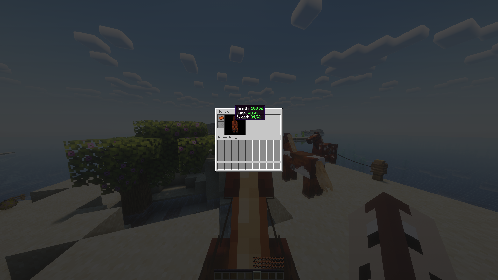

<p align="center">
    
</p>

<h1 align="center">PerfectlyBalancedHorses</h1>

<p align="center">Make horses useful again!</p>

<div align="center">
    <a href="https://lyzev.github.io/discord"></a>
    <br><br>
    
    
    <br>
    
    
    <br><br>
    <a href="https://github.com/Lyzev/PerfectlyBalancedHorses/actions/workflows/build.yml"></a>
    <a href="https://github.com/Lyzev/PerfectlyBalancedHorses/actions/workflows/gradle-wrapper-validation.yml"></a>
</div>

## Table of Contents

- [Description](#description)
- [Screenshots](#screenshots)
- [Configuration](#configuration)
- [Commands](#commands)
- [Tips](#tips)
- [License](#license)
- [Security](#security)
- [Contributing](#contributing)
- [Bugs and Suggestions](#bugs-and-suggestions)
    - [Discord](#discord)
    - [GitHub](#github)

## Description

PerfectlyBalancedHorses is a Minecraft plugin that enhances horse breeding by allowing players to breed horses with
improved stats. It modifies attributes such as movement speed, jump strength, and health, enabling the creation of
exceptionally fast, high-jumping, and healthy horses.

The plugin is also designed to be highly configurable, allowing server owners to customize the breeding process to suit
their server's needs. This includes the ability to adjust each attribute's maximum value, as well as the range of values
that can be inherited by offspring. The configuration options cover movement speed, jump strength, and health, with
additional settings to control whether excess or deficit attribute values should be ignored.

## Screenshots




## Configuration

The plugin's configuration file, `config.yml`, is located in the `plugins/PerfectlyBalancedHorses` directory. It is
divided into three sections, each corresponding to a different attribute: *speed*, *jump*, and *health*. Each section
contains the following settings:

- **modify**: A boolean value that determines whether the attribute should be modified during breeding.
- **multiplier**: A double value that determines how much the attribute should be multiplied by when breeding.
- **offspringRange**: A range of double values that determine the value that is applied to the parent's attribute value
  when breeding. The range is defined by a `start` and `end` value. If the `start` value is greater than 0, the
  offspring will inherit a value that is always greater than the parent's attribute average. Note that the `end` value
  must be greater than the `start` value. The math is as follows:
    - `parentAverage + (parentDifference + rangeBuffer) * randomFactor`
    - `randomFactor` is a random value between the `start` and `end` values.
    - `rangeBuffer` is 0.3 * the difference between the maximum (vanilla or custom) and vanilla minimum attribute value.
    - `parentDifference` is the absolute difference between the parent's attribute values.
- **ignoreExcess**: A boolean value that determines whether excess attribute values should be ignored.
- **ignoreDeficit**: A boolean value that determines whether deficit attribute values should be ignored.

The **use-vanilla-offspring-attribute-range** setting controls whether to use Minecraft's default offspring attribute
range. Set it to `true` for balanced attributes. If set to `false`, the `offspringRange` in the config file will be
used, which can result in very high or low attributes that can result in an unbalanced breeding system without steady
progression. It is recommended to set this to `true` for balanced gameplay.

Here is an example configuration file:

```yaml
use-vanilla-offspring-attribute-range: true
attributes:
  movement-speed:
    modify: true
    multiplier: 150.0
    offspring-attribute-range:
      start: -0.5
      end: 0.5
    ignore-excess: false
    ignore-deficit: false
  jump-strength:
    modify: true
    multiplier: 150.0
    offspring-attribute-range:
      start: -0.5
      end: 0.5
    ignore-excess: false
    ignore-deficit: false
  health:
    modify: true
    multiplier: 150.0
    offspring-attribute-range:
      start: -0.5
      end: 0.5
    ignore-excess: false
    ignore-deficit: false
```

*Note: The `multiplier` setting is a percentage value. For example, a `multiplier` of 150.0 will increase the attributes
max value by 50%.*

## Commands

The plugin provides the following commands:

- `/pbhreload`: Reloads the plugin's configuration file. Requires the `pbh.reload` permission.

## Tips

It is recommended to use the **Horse Statistics** client-side mod to view the horse's stats. This mod displays the
horse's speed, jump height, and health in the horse's inventory screen. It is available at the following link:
[Horse Statistics](https://modrinth.com/mod/horse-statistics).

*Note: The mod is not required to use the plugin, but it is highly recommended for a better user experience. Only use it
if it is allowed on the server you are playing on.*

## LICENSE

This project is licensed under the [AGPL-3.0 License](LICENSE).

## Security

If you discover a security vulnerability within this project, please refer to the [SECURITY.md](SECURITY.md) file for
more information on how to report it.

**Please do not disclose security-related issues publicly.**

*Note: This project is under AGPL-3.0 license, which means there is no warranty for this software. Use at your own risk.
See the [LICENSE](LICENSE) for more details.*

## Contributing

If you are interested in contributing to this project, please refer to the [CONTRIBUTING.md](CONTRIBUTING.md) file for
more information.

## Bugs and Suggestions

### Discord

For assistance with minor concerns, feel free to join our supportive community on
the [Discord server](https://lyzev.dev/discord). Our friendly members and staff are ready to help you.

### GitHub

To ensure a prompt and effective resolution of bugs or to share your suggestions, please submit them through
the [issue tracker](https://github.com/Lyzev/PerfectlyBalancedHorses/issues) of this repository. Kindly utilize the
provided templates
and make sure to include all relevant details that would help us understand your issue better. Your cooperation is
greatly appreciated.
